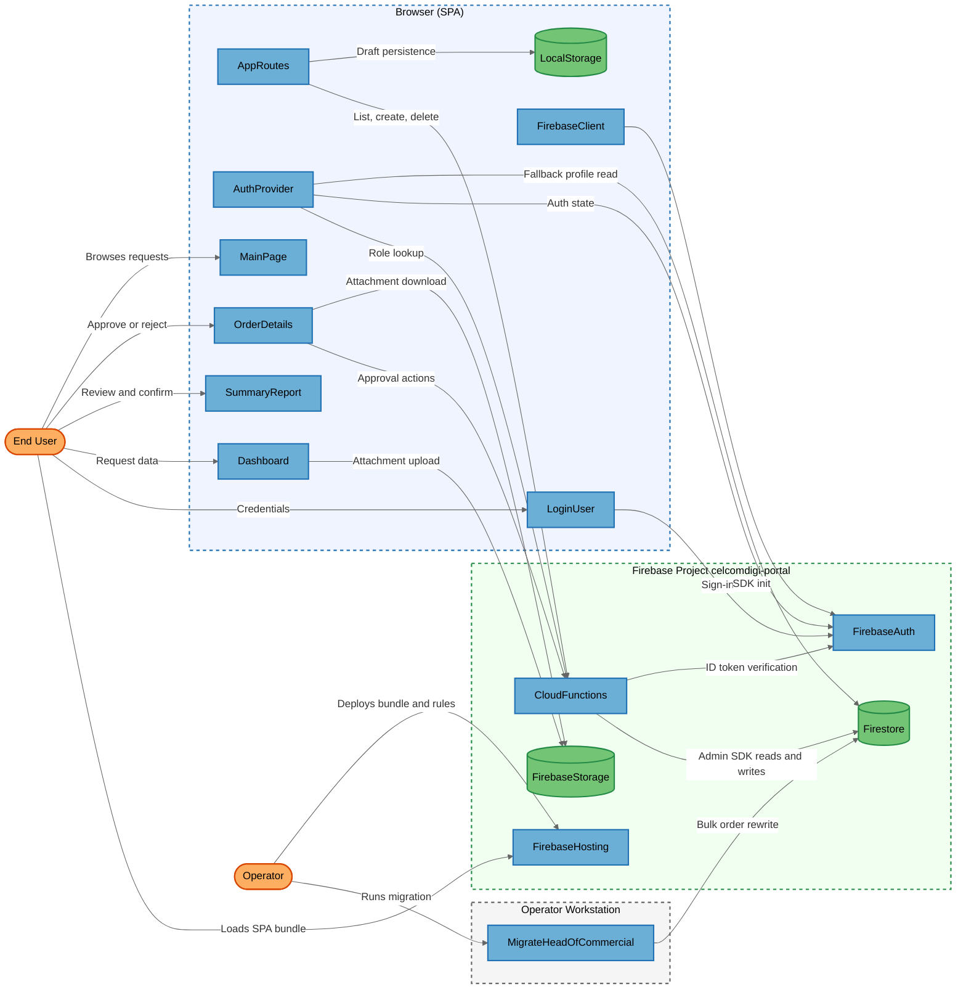
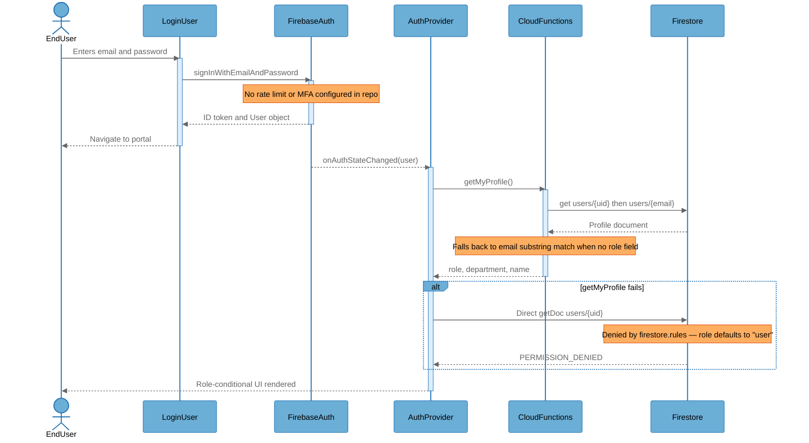
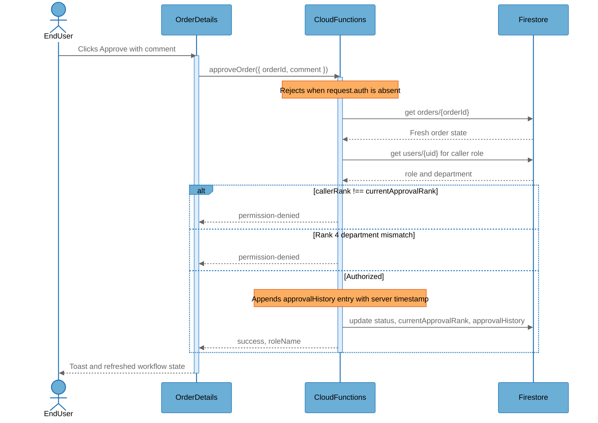

# Architecture Overview

## System Purpose

The Pricing Management System (internally "FA Request" / Financial Approval system) is a CelcomDigi internal web application for capturing, costing, and routing enterprise service pricing requests through a four-rank approval chain. Sales requesters enter one-time and annual service line items with vendor costs, SST, margins, and financing terms; the system computes gross/EBITDA/net margin and derives the required approval authority rank, then routes the request through Head of Sales (Rank 4) → Head of Commercial (Rank 3) → CEBO (Rank 2) → CFO (Rank 1). Users are internal staff in one of seven roles (`admin`, `user`, `rank4`, `rank3`, `rank2`, `rank1`, `viewer`), and the data handled — vendor cost bases, sales buffers, commission rates, and customer contract values — is commercially sensitive.

The system is a React single-page application deployed to Firebase Hosting, backed by Firebase Authentication, Cloud Firestore, Cloud Storage, and a set of Cloud Functions that hold all server-side authorization logic.

## Key Components

| Component | Type | Description |
|-----------|------|-------------|
| EndUser | External Interactor | Internal staff member (requester, approver, or viewer) operating the SPA through a browser. |
| Operator | External Interactor | Administrator who deploys the application and runs the Firestore data migration script with Admin SDK credentials. |
| FirebaseHosting | Process | Firebase Hosting site serving the compiled SPA bundle and rewriting all paths to `/index.html`. |
| AppRoutes | Process | Root router and application shell; owns route guards (`RequireAuth`, `RequireUser`, `BlockViewer`), draft state, and the create/delete order callable invocations. |
| AuthProvider | Process | React context that resolves the signed-in user's role, department, and name via the `getMyProfile` callable, with a direct-Firestore fallback path. |
| LoginUser | Process | Email/password sign-in screen; the unauthenticated entry point to the application. |
| FirebaseClient | Process | Firebase SDK initialization module holding the build-injected web config and the shared Firestore error handler. |
| MainPage | Process | Portal landing page listing FA requests with role-conditional action controls and aggregate status counters. |
| Dashboard | Process | Data-entry screen for service line items and order metadata; performs direct browser-to-Cloud-Storage attachment uploads. |
| SummaryReport | Process | Combined summary and margin computation screen; builds the order object that is persisted and gates finance-only panels by role. |
| OrderDetails | Process | Request detail view; invokes the submit, withdraw, approve, and reject callables and renders the approval audit log. |
| LocalStorage | Data Store | Browser HTML5 local storage holding per-UID in-progress draft services and order metadata, including cost and margin fields. |
| CloudFunctions | Process | Ten Firebase `onCall` HTTPS callable functions that hold all server-side authentication, authorization, and approval-workflow enforcement. |
| Firestore | Data Store | Cloud Firestore database holding the `orders`, `users`, and `counters` collections; client access is denied by security rules. |
| FirebaseAuth | External Service | Firebase Authentication (Identity Toolkit) issuing and verifying ID tokens for email/password sign-in. |
| FirebaseStorage | Data Store | Cloud Storage bucket holding draft PDF and Excel attachments under `draft-attachments/{uid}/`. |
| MigrateHeadOfCommercial | Process | Standalone Node.js maintenance script that rewrites `authorityLevel` and `finalDecisionMaker` across every order using the Admin SDK. |

## Component Diagram



## Top Scenarios

### Scenario 1: Sign In and Role Resolution

A staff member signs in with an email and password. Firebase Authentication issues an ID token, and `AuthProvider` then calls the `getMyProfile` callable to resolve the caller's role, department, and display name from the `users` collection using the Admin SDK. If the callable fails, the provider falls back to a direct Firestore read of `users/{uid}` and then `users/{email}`; if no profile document exists at all, the role is inferred from substrings in the email address.



### Scenario 2: Create and Submit an FA Request

A requester enters service line items and metadata on the Dashboard, optionally uploading PDF or Excel attachments straight from the browser to Cloud Storage. The SummaryReport screen computes margins and the derived authority rank, then calls `createOrder`, which verifies the caller holds the `user` role and allocates a sequential `FA-nnnn` order number inside a Firestore transaction. The creator then submits the draft through `submitForApproval`.

```mermaid
%%{init: {'theme': 'base', 'themeVariables': {
  'background': '#ffffff',
  'actorBkg': '#6baed6', 'actorBorder': '#2171b5', 'actorTextColor': '#000000',
  'signalColor': '#666666', 'signalTextColor': '#666666',
  'noteBkgColor': '#fdae61', 'noteBorderColor': '#d94701', 'noteTextColor': '#000000',
  'activationBkgColor': '#ddeeff', 'activationBorderColor': '#2171b5'
}}}%%
sequenceDiagram
    actor EndUser
    participant Dashboard as Dashboard
    participant FirebaseStorage as FirebaseStorage
    participant SummaryReport as SummaryReport
    participant AppRoutes as AppRoutes
    participant CloudFunctions as CloudFunctions
    participant Firestore as Firestore

    EndUser->>Dashboard: Enters services, costs, metadata
    activate Dashboard
    opt Attachment provided
        Dashboard->>FirebaseStorage: uploadBytesResumable draft-attachments/{uid}/{id}-{name}
        Note over FirebaseStorage: Rules check client-declared contentType only
        FirebaseStorage-->>Dashboard: Tokenized download URL
    end
    Dashboard-->>EndUser: Draft persisted to LocalStorage
    deactivate Dashboard

    EndUser->>SummaryReport: Reviews margins and confirms
    activate SummaryReport
    Note over SummaryReport: totalCost, totalRevenue, authority rank computed client-side
    SummaryReport->>AppRoutes: onConfirm(order)
    AppRoutes->>CloudFunctions: createOrder({ order, isNew })
    activate CloudFunctions
    Note over CloudFunctions: Verifies role === "user"; strips client id; stamps createdBy
    CloudFunctions->>Firestore: runTransaction on counters/orders
    Firestore-->>CloudFunctions: Next sequence value
    CloudFunctions->>Firestore: add orders document
    CloudFunctions-->>AppRoutes: success, orderNumber
    deactivate CloudFunctions
    SummaryReport-->>EndUser: Saved as Draft
    deactivate SummaryReport

    EndUser->>CloudFunctions: submitForApproval({ orderId })
    Note over CloudFunctions: Creator-only check; Draft status required
```

### Scenario 3: Multi-Rank Approval Decision

An approver opens a pending request and approves or rejects it with a mandatory comment. The `approveOrder` callable re-reads the order from Firestore, resolves the caller's role server-side, verifies the caller's rank matches the order's `currentApprovalRank`, applies the department check for Rank 4, appends an audit entry, and advances the order to the next rank or to a terminal state.



### Scenario 4: Role-Filtered Order Listing

Every four seconds the SPA calls `listOrders`, which reads the entire `orders` collection with the Admin SDK and then filters it in memory according to the caller's role: admins see everything, rank holders see requests pending at their rank or that they have already acted on, viewers see only requests where the `accountManager` field matches their profile name, and plain users see only requests they created. Viewer responses additionally have `totalCost`, `costPerUnit`, `totalSST`, and `salesBuffer` stripped before being returned.

### Scenario 5: Operator Data Migration

An operator runs `migrate-head-of-commercial.js` from a workstation using Application Default Credentials. The script enumerates every document in `orders` and rewrites legacy `authorityLevel` and `finalDecisionMaker` values in place, bypassing Firestore security rules entirely through the Admin SDK and leaving no audit record of the change.

## Technology Stack

| Layer | Technologies |
|-------|--------------|
| Languages | TypeScript 5.8, JavaScript (ES modules), JSX/TSX |
| Frameworks | React 19, React Router DOM 7, Vite 6, Tailwind CSS 4, shadcn/ui with Radix primitives, react-hook-form, Zod 4, Firebase Functions v2 (`onCall`) |
| Data Stores | Cloud Firestore (`orders`, `users`, `counters`), Firebase Cloud Storage (`draft-attachments/`), browser `localStorage` |
| Infrastructure | Firebase Hosting (SPA rewrite to `/index.html`), Cloud Functions for Firebase, Firebase project `celcomdigi-portal`, Google Cloud managed TLS |
| Security | Firebase Authentication (email/password), Firebase ID token verification via `request.auth` in callables, deny-all Cloud Firestore security rules, Cloud Storage security rules with per-UID write scoping and content-type/size constraints, server-side role and rank authorization in `functions/src/index.ts`, client-side route guards in `src/App.tsx` |

## Deployment Model

The system is a publicly reachable cloud application. `firebase.json` configures Firebase Hosting to serve the compiled Vite bundle from `dist/` on port 443 with a catch-all rewrite to `/index.html`, so the entire SPA — including all role-gating logic and the build-injected Firebase web configuration — is downloadable by any unauthenticated internet client. Cloud Functions are deployed as HTTPS callable endpoints on the public `*.cloudfunctions.net` domain; the endpoints accept and are billed for unauthenticated invocations, and each handler performs its own `request.auth` check before doing work. Cloud Firestore and Cloud Storage are reached over the public `googleapis.com` endpoints and are protected by security rules rather than network controls. There is no reverse proxy, WAF, rate limiter, or private networking layer between the internet and any component.

Firestore security rules deny all direct client reads and writes to `orders`, `users`, `counters`, and every other path, so all application data access must flow through the Cloud Functions layer. Cloud Storage rules are the one place where the browser still talks directly to a data store: any authenticated user may read any object under `draft-attachments/`, and a user may write and delete only under their own UID prefix. Attachment download URLs produced by `getDownloadURL()` carry a long-lived access token that bypasses the rules entirely for anyone holding the link.

The `functions/` directory contains only `src/index.ts` — there is no `package.json`, no `tsconfig.json`, and no `functions` block in `firebase.json`, so the Cloud Functions that hold the entire authorization model are not deployable from this repository as configured. Deployment of the bundle, rules, and functions is performed manually by an operator; there is no CI/CD pipeline in the repository.

**Deployment Classification:** `NETWORK_SERVICE`

### Component Exposure Table

| Component | Listens On | Auth Required | Reachability | Min Prerequisite | Derived Tier |
|-----------|------------|---------------|--------------|------------------|-------------|
| EndUser | N/A — external actor | N/A | External | None | T1 |
| Operator | N/A — external actor | N/A | External | Host/OS Access | T3 |
| FirebaseHosting | `0.0.0.0:443` (Firebase Hosting CDN) | No | External | None | T1 |
| AppRoutes | N/A — no listener (browser SPA module) | Yes (Firebase Auth session enforced by `RequireAuth`) | External | Authenticated User | T2 |
| AuthProvider | N/A — no listener (browser SPA module) | No (runs before a session exists) | External | None | T1 |
| LoginUser | N/A — no listener (browser SPA module) | No (unauthenticated entry point) | External | None | T1 |
| FirebaseClient | N/A — no listener (browser SPA module) | No (config shipped in public bundle) | External | None | T1 |
| MainPage | N/A — no listener (browser SPA module) | Yes (`RequireAuth`) | External | Authenticated User | T2 |
| Dashboard | N/A — no listener (browser SPA module) | Yes (`RequireAuth` + `RequireUser`) | External | Authenticated User | T2 |
| SummaryReport | N/A — no listener (browser SPA module) | Yes (`RequireAuth` + `BlockViewer`) | External | Authenticated User | T2 |
| OrderDetails | N/A — no listener (browser SPA module) | Yes (`RequireAuth`) | External | Authenticated User | T2 |
| LocalStorage | N/A — no listener (browser storage) | No | No Listener | Host/OS Access | T3 |
| CloudFunctions | `0.0.0.0:443` (`*.cloudfunctions.net` callable endpoints) | No at endpoint; Yes in handler (`request.auth`) | External | None | T1 |
| Firestore | `firestore.googleapis.com:443` | Yes (deny-all client rules; Admin SDK only) | External | Admin Credentials | T3 |
| FirebaseAuth | `identitytoolkit.googleapis.com:443` | No (sign-in accepts unauthenticated attempts) | External | None | T1 |
| FirebaseStorage | `firebasestorage.googleapis.com:443` | Yes for SDK paths; No for tokenized download URLs | External | None | T1 |
| MigrateHeadOfCommercial | N/A — no listener (one-shot Node.js script) | No (Application Default Credentials) | No Listener | Host/OS Access | T3 |

## Security Infrastructure Inventory

| Component | Security Role | Configuration | Notes |
|-----------|---------------|---------------|-------|
| Firebase Authentication | Identity provider and token issuer | Email/password provider; ID tokens verified by callables via `request.auth` | No MFA, password policy, or App Check configuration present in the repository. |
| Cloud Firestore Security Rules | Data-layer access control | `firestore.rules` — `allow read, write: if false` on `orders`, `users`, `counters`, and `{document=**}` | Deny-all posture forces all data access through Cloud Functions; explicitly documented in the rules file as closing a prior authorization hole. |
| Cloud Storage Security Rules | Object-layer access control | `storage.rules` — write and delete scoped to `request.auth.uid`; content type restricted to PDF/XLSX/XLS; size capped at 5 MB (PDF) and 100 MB (Excel) | Read is granted to any authenticated user across all UID prefixes. |
| CloudFunctions authorization layer | Server-side authentication and authorization | `functions/src/index.ts` — `request.auth` check on all ten callables; role resolved server-side by `getCallerProfile`; rank/department checks in `approveOrder` and `rejectOrder`; creator-only checks in `submitForApproval` and `withdrawFromReview`; admin-only check in `deleteOrder` | Re-reads order state from Firestore rather than trusting client-supplied state. |
| Server-side field stripping | Confidentiality control for the viewer role | `stripForViewer()` removes `totalCost` from orders and `costPerUnit`, `totalCost`, `totalSST`, `salesBuffer` from services | Applied in `getOrder` and `listOrders` for `role === "viewer"`. |
| Server-side order numbering | Integrity control | `createOrder` allocates `FA-nnnn` inside `db.runTransaction` on `counters/orders` | Prevents duplicate or client-chosen order numbers. |
| Client route guards | Defense-in-depth UI gating | `src/App.tsx` — `RequireAuth`, `RequireUser`, `BlockViewer` | Cosmetic only; bypassable in the browser, backed by the server checks above. |
| Per-UID draft namespacing | Local data separation | `src/App.tsx` — `localStorage` keys `services_${uid}` and `orderMetadata_${uid}` | Prevents one account's draft leaking into another account's session on a shared browser. |
| Approval audit log | Non-repudiation control | `approvalHistory` entries written server-side with `approvedBy` from the verified token and `approvedAt` from server clock | Covers approve and reject only; create, edit, delete, submit, and withdraw are not logged. |
| Secret handling | Configuration management | `.gitignore` excludes `.env*` except `.env.example`; Vite `define` injects Firebase and Gemini values at build time | Injection places any configured `GEMINI_API_KEY` into the public client bundle. |

## Repository Structure

| Directory | Purpose |
|-----------|---------|
| `src/` | React SPA source — entry point, router, types, and Firebase SDK initialization. |
| `src/pages/` | Route-level screens: `LoginUser`, `MainPage`, `Dashboard`, `SummaryReport`, `OrderDetails`. |
| `src/components/` | Application components: `Header`, `ServiceList`, `ServiceForm`, `ChangeHistory`. |
| `src/context/` | `AuthContext.tsx` — authentication state and role resolution. |
| `src/hooks/` | `useFirestoreOrders.ts` — polling data access against the `listOrders` callable. |
| `src/utils/` | `orderDiff.ts` — version-to-version change computation for the audit view. |
| `components/ui/` | shadcn/ui primitives (button, dialog, table, select, and related). |
| `functions/src/` | Cloud Functions source holding all server-side authorization logic. |
| `public/`, `dist/` | Static assets and the built SPA bundle served by Firebase Hosting. |
| Repository root | `firebase.json`, `firestore.rules`, `storage.rules`, `vite.config.ts`, `.env`, `migrate-head-of-commercial.js`. |
