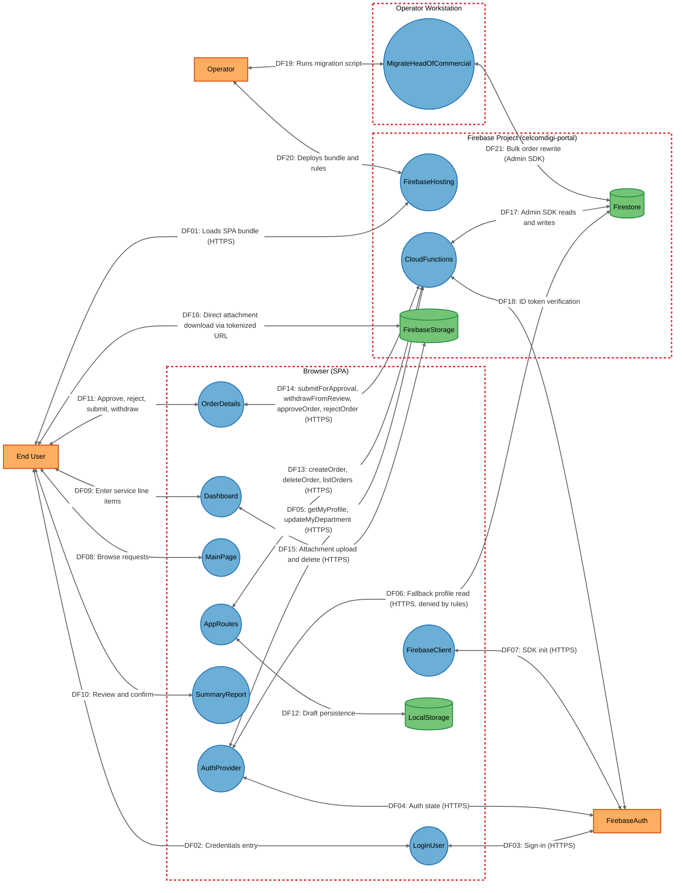
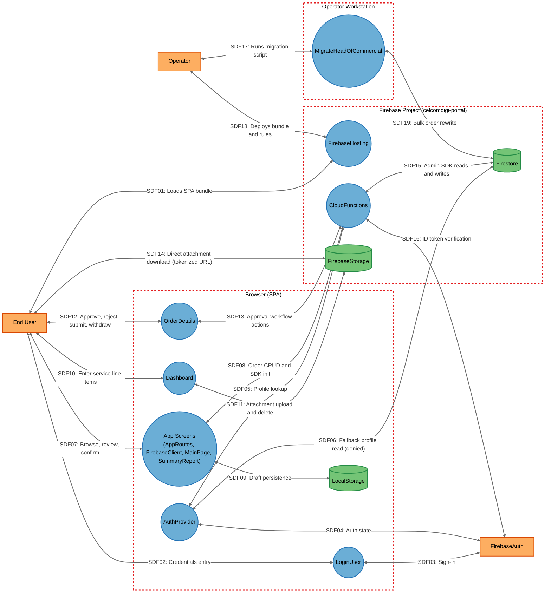

# Threat Model

## Data Flow Diagram

## Element Table

| Element | Type | TMT Category | Description | Trust Boundary |
|---------|------|--------------|-------------|----------------|
| EndUser | External Interactor | SE.EI.TMCore.User | Internal staff member operating the SPA through a browser. | — (external) |
| Operator | External Interactor | SE.EI.TMCore.User | Administrator who deploys the app and runs the migration script. | — (external) |
| FirebaseAuth | External Interactor | SE.EI.TMCore.AuthProvider | Firebase Authentication identity provider issuing and verifying ID tokens. | — (external) |
| AppRoutes | Process | SE.P.TMCore.BrowserClient | Root router, route guards, draft state, create/delete/list order calls. | Browser |
| AuthProvider | Process | SE.P.TMCore.BrowserClient | React context resolving role/department/name via `getMyProfile` with Firestore fallback. | Browser |
| LoginUser | Process | SE.P.TMCore.BrowserClient | Email/password sign-in screen. | Browser |
| FirebaseClient | Process | SE.P.TMCore.BrowserClient | Firebase SDK initialization module holding build-injected config and error handler. | Browser |
| MainPage | Process | SE.P.TMCore.BrowserClient | Portal landing page listing FA requests with role-conditional controls. | Browser |
| Dashboard | Process | SE.P.TMCore.BrowserClient | Data-entry screen for service line items; direct browser-to-storage uploads. | Browser |
| SummaryReport | Process | SE.P.TMCore.BrowserClient | Combined summary/margin computation screen; builds the persisted order object. | Browser |
| OrderDetails | Process | SE.P.TMCore.BrowserClient | Request detail view invoking submit/withdraw/approve/reject callables. | Browser |
| LocalStorage | Data Store | SE.DS.TMCore.HTML5LS | Per-UID browser local storage holding in-progress draft services and metadata. | Browser |
| FirebaseHosting | Process | SE.P.TMCore.WebServer | Firebase Hosting CDN serving the SPA bundle with SPA rewrite. | FirebaseBackend |
| CloudFunctions | Process | SE.P.TMCore.WebSvc | Ten `onCall` HTTPS callables holding all server-side authorization logic. | FirebaseBackend |
| Firestore | Data Store | SE.DS.TMCore.NoSQL | Cloud Firestore holding `orders`, `users`, `counters`; deny-all client rules. | FirebaseBackend |
| FirebaseStorage | Data Store | SE.DS.TMCore.CloudStorage | Cloud Storage bucket holding draft PDF/Excel attachments. | FirebaseBackend |
| MigrateHeadOfCommercial | Process | SE.P.TMCore.OSProcess | One-shot Node.js Admin SDK maintenance script rewriting order fields in bulk. | OperatorWorkstation |

## Data Flow Table

| ID | Source | Target | Protocol | Description |
|----|--------|--------|----------|-------------|
| DF01 | EndUser | FirebaseHosting | HTTPS | Loads the compiled SPA bundle. |
| DF02 | EndUser | LoginUser | In-browser | Enters email and password. |
| DF03 | LoginUser | FirebaseAuth | HTTPS | `signInWithEmailAndPassword` sign-in exchange. |
| DF04 | AuthProvider | FirebaseAuth | HTTPS | `onAuthStateChanged` session/token state. |
| DF05 | AuthProvider | CloudFunctions | HTTPS | `getMyProfile`, `updateMyDepartment` callable invocations. |
| DF06 | AuthProvider | Firestore | HTTPS | Fallback direct read of `users/{uid}`/`users/{email}` (denied by rules). |
| DF07 | FirebaseClient | FirebaseAuth | HTTPS | Firebase SDK initialization / auth instance creation. |
| DF08 | EndUser | MainPage | In-browser | Browses the FA request portal. |
| DF09 | EndUser | Dashboard | In-browser | Enters service line items and order metadata. |
| DF10 | EndUser | SummaryReport | In-browser | Reviews computed margins and confirms the order. |
| DF11 | EndUser | OrderDetails | In-browser | Submits, withdraws, approves, or rejects a request. |
| DF12 | AppRoutes | LocalStorage | Browser storage API | Persists per-UID draft services and metadata. |
| DF13 | AppRoutes | CloudFunctions | HTTPS | `createOrder`, `deleteOrder` callables; `listOrders` polling every 4s. |
| DF14 | OrderDetails | CloudFunctions | HTTPS | `submitForApproval`, `withdrawFromReview`, `approveOrder`, `rejectOrder` callables. |
| DF15 | Dashboard | FirebaseStorage | HTTPS | `uploadBytesResumable` / `deleteObject` for draft attachments. |
| DF16 | EndUser | FirebaseStorage | HTTPS | Direct browser navigation to a tokenized `getDownloadURL()` link. |
| DF17 | CloudFunctions | Firestore | Admin SDK (gRPC/HTTPS) | Reads and writes to `orders`, `users`, `counters` with full privileges. |
| DF18 | CloudFunctions | FirebaseAuth | HTTPS | Verification of the caller's ID token via `request.auth`. |
| DF19 | Operator | MigrateHeadOfCommercial | Local execution | Runs the migration script from a workstation. |
| DF20 | Operator | FirebaseHosting | HTTPS (Firebase CLI) | Deploys the built bundle, `firestore.rules`, and `storage.rules`. |
| DF21 | MigrateHeadOfCommercial | Firestore | Admin SDK (gRPC/HTTPS) | Bulk rewrite of `authorityLevel` and `finalDecisionMaker` across all orders. |

## Trust Boundary Table

| Boundary | Description | Contains |
|----------|-------------|----------|
| Browser | The end user's browser process running the React SPA; fully attacker-controlled client environment. | AppRoutes, AuthProvider, LoginUser, FirebaseClient, MainPage, Dashboard, SummaryReport, OrderDetails, LocalStorage |
| FirebaseBackend | The `celcomdigi-portal` Firebase project's managed backend services, reached over the public internet. | FirebaseHosting, CloudFunctions, Firestore, FirebaseStorage |
| OperatorWorkstation | An administrator's local machine used for deployment and one-off data migrations with Admin SDK credentials. | MigrateHeadOfCommercial |

## Summary View

## Summary to Detailed Mapping

| Summary Element | Contains | Summary Flows | Maps to Detailed Flows |
|-----------------|----------|---------------|------------------------|
| AppScreens | AppRoutes, FirebaseClient, MainPage, SummaryReport | SDF07, SDF08, SDF09 | DF07, DF08, DF10, DF12, DF13 |
| LoginUser | LoginUser | SDF02, SDF03 | DF02, DF03 |
| AuthProvider | AuthProvider | SDF04, SDF05, SDF06 | DF04, DF05, DF06 |
| Dashboard | Dashboard | SDF10, SDF11 | DF09, DF15 |
| OrderDetails | OrderDetails | SDF12, SDF13 | DF11, DF14 |
| LocalStorage | LocalStorage | SDF09 | DF12 |
| FirebaseHosting | FirebaseHosting | SDF01, SDF18 | DF01, DF20 |
| CloudFunctions | CloudFunctions | SDF08, SDF13, SDF15, SDF16 | DF05, DF13, DF14, DF17, DF18 |
| Firestore | Firestore | SDF06, SDF15, SDF19 | DF06, DF17, DF21 |
| FirebaseStorage | FirebaseStorage | SDF11, SDF14 | DF15, DF16 |
| MigrateHeadOfCommercial | MigrateHeadOfCommercial | SDF17, SDF19 | DF19, DF21 |
