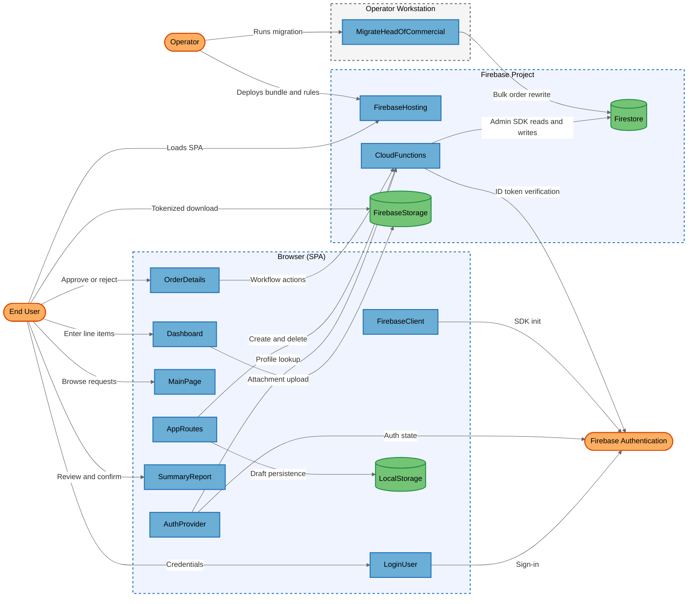
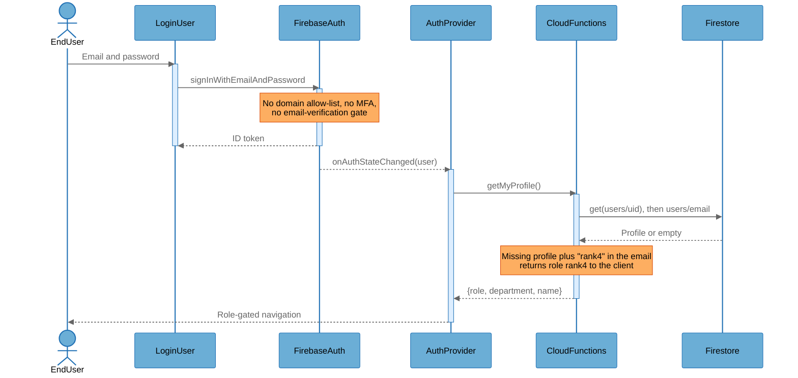

# Architecture Overview

## System Purpose

This repository implements a Financial Approval (FA) request system for pricing and costing service line items — a CelcomDigi-branded "Pricing Management System". Requesters build multi-line-item costing sheets (units, cost per unit, SST, sales buffer, installment terms), the system computes a per-line-item EBITDA margin and derives a Level of Authority from it, and the resulting request is routed through a four-step approval chain (Rank 4 Head of Department → Rank 3 Head of Commercial → Rank 2 CEBO → Rank 1 CFO). Users are sales requesters, departmental and executive approvers, read-only account-manager viewers, and a super-admin. The system is a React single-page application backed entirely by Firebase Cloud Functions, Firestore, Firebase Storage, and Firebase Authentication.

## Key Components

| Component | Type | Description |
|-----------|------|-------------|
| AppRoutes | Process | Router and application shell in `src/App.tsx`; owns route guards, draft state, and the createOrder/deleteOrder callable wrappers. |
| AuthProvider | Process | React auth context in `src/context/AuthContext.tsx`; resolves the caller's role, department, and name via `getMyProfile` with a direct-Firestore fallback. |
| CloudFunctions | Process | The nine `onCall` callable endpoints in `functions/src/index.ts`; the sole write path to Firestore and the only place authorization is enforced. |
| Dashboard | Process | Line-item entry screen in `src/pages/Dashboard.tsx`; also owns attachment upload and deletion against Firebase Storage. |
| EndUser | External Interactor | Requester, approver (Rank 1–4), read-only viewer, or super-admin operating the SPA in a browser. |
| FirebaseAuth | External Service | Google-managed identity provider; issues the ID tokens that callable functions verify. |
| FirebaseClient | Process | SDK bootstrap in `src/firebase.ts`; builds the Firebase app from build-time-injected config and exports auth, db, storage, and functions handles. |
| FirebaseHosting | Process | Static host defined by the `hosting` block of `firebase.json`; serves the compiled SPA bundle from `dist/` with a catch-all rewrite to `index.html`. |
| FirebaseStorage | Data Store | Object store for draft attachments under `draft-attachments/{uid}/`, governed by `storage.rules`. |
| Firestore | Data Store | Document store holding the `orders`, `users`, and `counters` collections; `firestore.rules` denies all direct client access. |
| LocalStorage | Data Store | Per-UID browser storage holding the in-progress draft (`services_{uid}`, `orderMetadata_{uid}`). |
| LoginUser | Process | Email/password sign-in screen in `src/pages/LoginUser.tsx`. |
| MainPage | Process | Request list and version-history screen in `src/pages/MainPage.tsx`. |
| MigrateHeadOfCommercial | Process | Operator-run Admin SDK script `migrate-head-of-commercial.js` that bulk-rewrites authority labels across every order document. |
| Operator | External Interactor | Deployer/administrator who publishes the bundle and rules and runs the migration script from a workstation. |
| OrderDetails | Process | Request detail, approval-decision, submit, and withdraw screen in `src/pages/OrderDetails.tsx`. |
| SummaryReport | Process | Costing/pricing summary and order-confirmation screen in `src/pages/SummaryReport.tsx`. |

## Component Diagram



## Top Scenarios

### Scenario 1: Requester creates an FA request

A signed-in Requester enters service line items in Dashboard, reviews the computed pricing and costing in SummaryReport, and confirms. AppRoutes calls the `createOrder` callable, which re-derives every financial figure and the Level of Authority from the raw inputs, allocates a sequential FA number inside a Firestore transaction, and persists the document as a Draft.

```mermaid
%%{init: {'theme': 'base', 'themeVariables': {
  'background': '#ffffff',
  'actorBkg': '#6baed6', 'actorBorder': '#2171b5', 'actorTextColor': '#000000',
  'signalColor': '#666666', 'signalTextColor': '#666666',
  'noteBkgColor': '#fdae61', 'noteBorderColor': '#d94701', 'noteTextColor': '#000000',
  'activationBkgColor': '#ddeeff', 'activationBorderColor': '#2171b5',
  'sequenceNumberColor': '#767676',
  'labelBoxBkgColor': '#f0f0f0', 'labelBoxBorderColor': '#666666', 'labelTextColor': '#000000',
  'loopTextColor': '#000000'
}}}%%
sequenceDiagram
    actor EndUser
    participant Dashboard as Dashboard
    participant SummaryReport as SummaryReport
    participant AppRoutes as AppRoutes
    participant CloudFunctions as CloudFunctions
    participant Firestore as Firestore

    EndUser->>Dashboard: Enter service line items
    activate Dashboard
    Dashboard-->>EndUser: Live margin preview
    deactivate Dashboard
    EndUser->>SummaryReport: Confirm request
    activate SummaryReport
    SummaryReport->>AppRoutes: onConfirm(order, isNew)
    AppRoutes->>CloudFunctions: createOrder({order, isNew})
    activate CloudFunctions
    Note over CloudFunctions: Verifies ID token, requires role "user"
    Note over CloudFunctions: Strips status, rank and history; recomputes<br/>Level of Authority from raw inputs
    CloudFunctions->>Firestore: Transaction: increment counters/orders
    Firestore-->>CloudFunctions: FA-NNNN
    CloudFunctions->>Firestore: add(orders) status "Draft"
    Firestore-->>CloudFunctions: Document id
    CloudFunctions-->>AppRoutes: {success, orderNumber, id}
    deactivate CloudFunctions
    SummaryReport-->>EndUser: Confirmation toast
    deactivate SummaryReport
```

### Scenario 2: Approval chain advances one rank

The creator submits the Draft, which moves it to `Pending Approval - Rank 4`. The approver holding that rank opens OrderDetails, enters a mandatory comment, and approves. `approveOrder` re-reads the order from Firestore, re-derives the caller's role server-side, enforces the rank and department match, appends an audit entry, and either advances to the next rank or marks the request Approved.

```mermaid
%%{init: {'theme': 'base', 'themeVariables': {
  'background': '#ffffff',
  'actorBkg': '#6baed6', 'actorBorder': '#2171b5', 'actorTextColor': '#000000',
  'signalColor': '#666666', 'signalTextColor': '#666666',
  'noteBkgColor': '#fdae61', 'noteBorderColor': '#d94701', 'noteTextColor': '#000000',
  'activationBkgColor': '#ddeeff', 'activationBorderColor': '#2171b5',
  'sequenceNumberColor': '#767676',
  'labelBoxBkgColor': '#f0f0f0', 'labelBoxBorderColor': '#666666', 'labelTextColor': '#000000',
  'loopTextColor': '#000000'
}}}%%
sequenceDiagram
    actor EndUser
    participant OrderDetails as OrderDetails
    participant CloudFunctions as CloudFunctions
    participant Firestore as Firestore

    EndUser->>OrderDetails: Submit for approval
    activate OrderDetails
    OrderDetails->>CloudFunctions: submitForApproval({orderId, note})
    activate CloudFunctions
    Note over CloudFunctions: Creator-only check; status must be Draft
    CloudFunctions->>Firestore: update status "Pending Approval - Rank 4"
    Note over CloudFunctions: approvalHistory is reset to an empty array
    deactivate CloudFunctions
    deactivate OrderDetails
    EndUser->>OrderDetails: Approve with comment
    activate OrderDetails
    OrderDetails->>CloudFunctions: approveOrder({orderId, comment})
    activate CloudFunctions
    CloudFunctions->>Firestore: get(orders/orderId)
    Firestore-->>CloudFunctions: Fresh order state
    CloudFunctions->>Firestore: get(users/uid) then users/email
    Firestore-->>CloudFunctions: role and department
    Note over CloudFunctions: Caller rank must equal currentApprovalRank;<br/>Rank 4 must match headOfDepartment
    CloudFunctions->>Firestore: update status, rank, approvalHistory
    CloudFunctions-->>OrderDetails: {success, roleName}
    deactivate CloudFunctions
    OrderDetails-->>EndUser: Decision recorded
    deactivate OrderDetails
```

### Scenario 3: Sign-in and role resolution

An unauthenticated user submits email and password to Firebase Authentication. On success, AuthProvider calls `getMyProfile`, which reads `users/{uid}` and falls back to `users/{email}`, then derives a department for Rank 4 approvers from the email address when none is stored. The resolved role drives every client-side route guard and control-visibility decision.



### Scenario 4: Viewer reads a redacted request

A user with the `viewer` role polls `listOrders`. The function matches orders whose `accountManager` string equals the viewer's profile name, then passes each through `stripForViewer`, which removes `totalCost` at order level and `costPerUnit`, `totalCost`, `totalSST`, and `salesBuffer` from each service before returning. OrderDetails additionally hides costing columns and the financial-analysis cards for that role.

### Scenario 5: Attachment upload and retrieval

Dashboard uploads a PDF or Excel file directly to `draft-attachments/{uid}/{attachmentId}-{filename}` using the Storage SDK, then calls `getDownloadURL` and stores the returned URL in the draft metadata. When the order is created, that URL is persisted verbatim on the order document and rendered as an anchor for every reader of the request, including approvers who cannot read the underlying object path.

## Technology Stack

| Layer | Technologies |
|-------|--------------|
| Languages | TypeScript, JavaScript (CommonJS migration script), TSX |
| Frameworks | React 19, React Router 7, Vite 6, Tailwind CSS 4, shadcn/Radix UI, react-hook-form, Zod, Firebase Functions v2 (`onCall`) |
| Data Stores | Cloud Firestore (`orders`, `users`, `counters`), Firebase Storage (`draft-attachments/`), browser `localStorage` |
| Infrastructure | Firebase Hosting (static SPA from `dist/`), Firebase Cloud Functions (2nd gen), Google Cloud project `ai-studio-remixremixservic-d5598bb1-8a51-4e0b-bbad-dc118e2c4552` per `firebase.json` |
| Security | Firebase Authentication (email/password), Firebase ID token verification in `onCall`, `firestore.rules` deny-all, `storage.rules` owner-scoped path rules, server-side role and rank enforcement in `functions/src/index.ts` |

## Deployment Model

The system is a publicly reachable cloud application. The compiled SPA is served over HTTPS from Firebase Hosting with a catch-all rewrite to `index.html`; no `headers` block is configured, so only Firebase Hosting's own default headers apply. The nine callable functions are exposed on public `https://<region>-<project>.cloudfunctions.net/<name>` endpoints (2nd-gen `onCall`), each of which begins by rejecting requests without `request.auth`. Firestore is reachable at Google's public API endpoint but `firestore.rules` denies every direct client read and write, so all application data flows through the Admin SDK inside the functions. Firebase Storage is reachable publicly; `storage.rules` restricts path-based access to the owning UID, while `getDownloadURL` tokens grant unauthenticated object access to anyone holding the URL. There are no private endpoints, VPC restrictions, IP allow-lists, or App Check attestation configured anywhere in the repository.

**Deployment Classification:** `NETWORK_SERVICE`

### Component Exposure Table

| Component | Listens On | Auth Required | Reachability | Min Prerequisite | Derived Tier |
|-----------|------------|---------------|--------------|------------------|-------------|
| AppRoutes | N/A — browser execution context | Yes (RequireAuth guard + ID token on callables) | External | Authenticated User | T2 |
| AuthProvider | N/A — browser execution context | Yes (runs only after onAuthStateChanged yields a user) | External | Authenticated User | T2 |
| CloudFunctions | `https://<region>-<project>.cloudfunctions.net/*` (443) | Yes (Firebase ID token checked in every callable) | External | Authenticated User | T2 |
| Dashboard | N/A — browser execution context | Yes (RequireAuth + RequireUser guards) | External | Authenticated User | T2 |
| EndUser | N/A — human actor | No | No Listener | Host/OS Access | T3 |
| FirebaseAuth | `identitytoolkit.googleapis.com` (443) | No (sign-in and account-creation endpoints are open by design) | External | None | T1 |
| FirebaseClient | N/A — browser execution context | No (initialises before sign-in) | External | None | T1 |
| FirebaseHosting | `<project>.web.app` (443) | No | External | None | T1 |
| FirebaseStorage | `firebasestorage.googleapis.com` (443) | No (download tokens bypass rules); rules apply to path access | External | None | T1 |
| Firestore | `firestore.googleapis.com` (443) | Yes (deny-all rules for clients; service account for Admin SDK) | External | Authenticated User | T2 |
| LocalStorage | N/A — no listener | No | No Listener | Host/OS Access | T3 |
| LoginUser | N/A — browser execution context | No (pre-authentication route) | External | None | T1 |
| MainPage | N/A — browser execution context | Yes (RequireAuth guard) | External | Authenticated User | T2 |
| MigrateHeadOfCommercial | N/A — no listener | Yes (Application Default Credentials) | No Listener | Admin Credentials | T3 |
| Operator | N/A — human actor | No | No Listener | Host/OS Access | T3 |
| OrderDetails | N/A — browser execution context | Yes (RequireAuth guard) | External | Authenticated User | T2 |
| SummaryReport | N/A — browser execution context | Yes (RequireAuth + BlockViewer guards) | External | Authenticated User | T2 |

## Security Infrastructure Inventory

| Component | Security Role | Configuration | Notes |
|-----------|---------------|---------------|-------|
| FirebaseAuth | Identity provider | Email/password sign-in via `signInWithEmailAndPassword` (`src/pages/LoginUser.tsx:27`) | No domain allow-list, blocking function, MFA enrolment, or email-verification gate anywhere in the repository. |
| `onCall` authentication guard | Request authentication | Every callable begins `if (!request.auth) throw new HttpsError("unauthenticated", …)` (`functions/src/index.ts`) | Present and consistent across all nine callables; this is a real control, not a gap. |
| `firestore.rules` | Client data access control | `allow read, write: if false` for `orders`, `users`, `counters`, and a catch-all deny | Effective deny-all; all data access is forced through the Admin SDK. Verified secure, not a finding. |
| `storage.rules` | Object access control | Owner-scoped read/write/delete on `draft-attachments/{userId}/{fileName}`, with content-type and size limits | Path access is correctly owner-scoped; tokenized download URLs are outside this control's reach. |
| `getCallerProfile` | Server-side role resolution | `functions/src/index.ts` — reads `users/{uid}` then `users/{email}`, defaults role to `"user"` | The single enforcement-side role source. The default-grant behaviour is covered by FIND-11. |
| Server-side Level of Authority recomputation | Integrity of approval routing | `authorityForService` + `createOrder` recompute every financial figure and overwrite the submitted values | Strong existing control that neutralises client-side tampering with margins and authority rank. |
| Firestore counter transaction | Uniqueness of FA numbers | `db.runTransaction` over `counters/orders` in `createOrder` | Prevents duplicate FA numbers on the `isNew` path; does not cover the `isNew=false` path (FIND-07). |
| Rank 4 department fail-closed check | Approval authorization | `approveOrder` / `rejectOrder` reject when either the caller's department or `order.headOfDepartment` is absent | Correct on the mutation path; the read path in `listOrders` uses the opposite polarity (FIND-05). |
| Firebase Hosting TLS | Transport security | Managed certificate with HSTS on `*.web.app` by default | Platform-provided; no repository configuration required. |

## Repository Structure

| Directory | Purpose |
|-----------|---------|
| `src/` | React SPA source — pages, components, context, hooks, and the Firebase SDK bootstrap. |
| `src/pages/` | Route-level screens: LoginUser, MainPage, Dashboard, SummaryReport, OrderDetails. |
| `src/context/` | AuthProvider — role, department, and name resolution shared across the app. |
| `src/hooks/` | `useFirestoreOrders` — the 4-second `listOrders` polling loop. |
| `src/utils/` | `orderDiff.ts` — version-to-version change computation for the change-history panel. |
| `components/ui/` | shadcn/Radix presentation primitives. |
| `functions/src/` | All nine Cloud Functions callables; the only authorization enforcement point. |
| `dist/` | Compiled SPA bundle published by Firebase Hosting (git-ignored, present on disk). |
| `public/` | Static assets copied into the bundle. |
