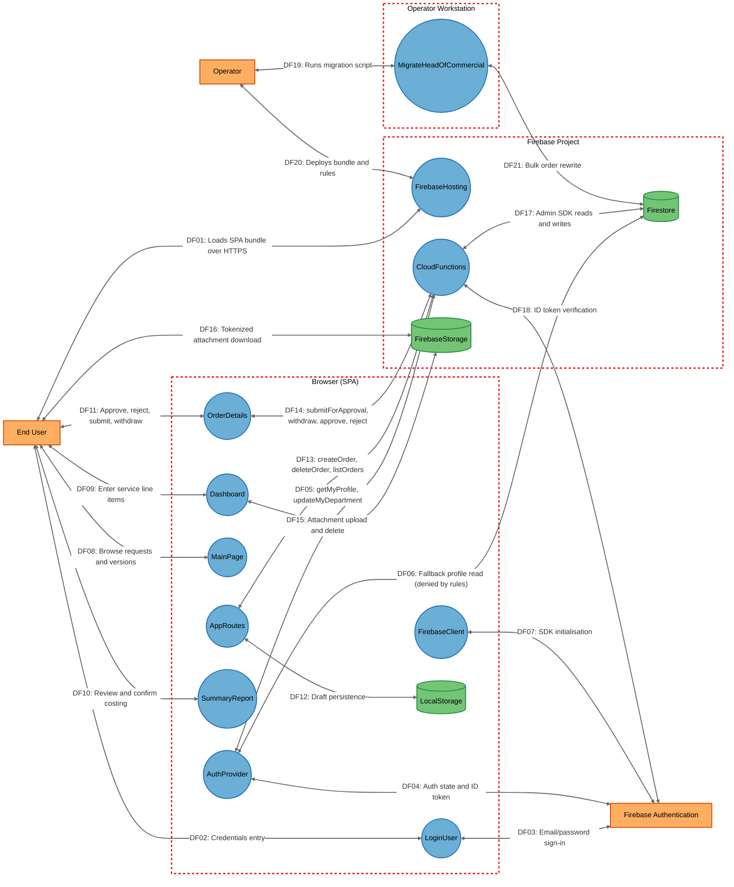
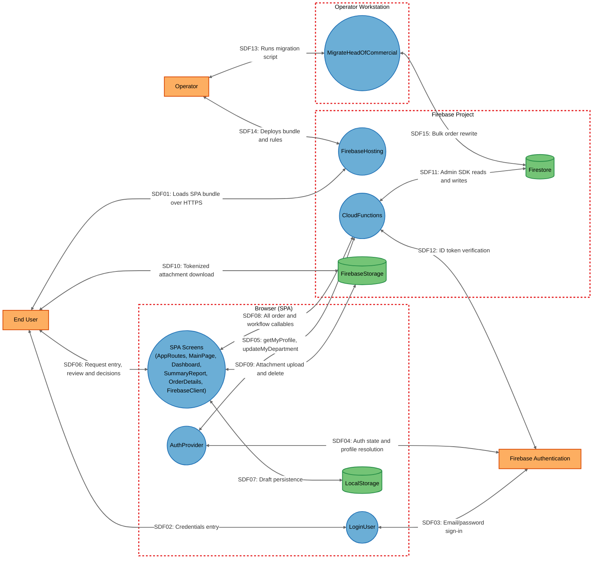

# Threat Model

## Data Flow Diagram

## Element Table

| Element | Type | TMT Category | Description | Trust Boundary |
|---------|------|--------------|-------------|----------------|
| AppRoutes | Process | `SE.P.TMCore.BrowserClient` | Router, route guards, draft state, and the createOrder/deleteOrder callable wrappers. | Browser |
| AuthProvider | Process | `SE.P.TMCore.BrowserClient` | Resolves role, department, and name; owns the getMyProfile call and its direct-Firestore fallback. | Browser |
| CloudFunctions | Process | `SE.P.TMCore.WebSvc` | Nine `onCall` HTTPS endpoints; the only authorization enforcement point and the only Firestore write path. | FirebaseBackend |
| Dashboard | Process | `SE.P.TMCore.BrowserClient` | Line-item entry screen and attachment upload/delete client. | Browser |
| EndUser | External Interactor | `SE.EI.TMCore.User` | Requester, Rank 1–4 approver, viewer, or super-admin. | — |
| FirebaseAuth | External Interactor | `SE.EI.TMCore.AuthProvider` | Google-managed identity provider issuing and validating ID tokens. | — |
| FirebaseClient | Process | `SE.P.TMCore.BrowserClient` | Firebase SDK bootstrap; builds the app from build-time-injected config. | Browser |
| FirebaseHosting | Process | `SE.P.TMCore.WebServer` | Static host serving the compiled bundle with a catch-all SPA rewrite. | FirebaseBackend |
| FirebaseStorage | Data Store | `SE.DS.TMCore.CloudStorage` | Attachment object store under `draft-attachments/{uid}/`. | FirebaseBackend |
| Firestore | Data Store | `SE.DS.TMCore.NoSQL` | Document store for `orders`, `users`, and `counters`; client access denied by rules. | FirebaseBackend |
| LocalStorage | Data Store | `SE.DS.TMCore.HTML5LS` | Per-UID in-progress draft: service line items and order metadata. | Browser |
| LoginUser | Process | `SE.P.TMCore.BrowserClient` | Pre-authentication email/password sign-in screen. | Browser |
| MainPage | Process | `SE.P.TMCore.BrowserClient` | Request list, statistics, and version-history screen. | Browser |
| MigrateHeadOfCommercial | Process | `SE.P.TMCore.OSProcess` | Operator-run Admin SDK script performing an unbounded bulk rewrite of order documents. | OperatorWorkstation |
| Operator | External Interactor | `SE.EI.TMCore.User` | Deployer/administrator publishing artefacts and running maintenance scripts. | — |
| OrderDetails | Process | `SE.P.TMCore.BrowserClient` | Request detail, approval decision, submit, and withdraw screen. | Browser |
| SummaryReport | Process | `SE.P.TMCore.BrowserClient` | Costing/pricing summary and order-confirmation screen. | Browser |

## Data Flow Table

| ID | Source | Target | Protocol | Description |
|----|--------|--------|----------|-------------|
| DF01 | EndUser | FirebaseHosting | HTTPS | Loads the compiled SPA bundle; no authentication required. |
| DF02 | EndUser | LoginUser | In-browser | Enters email and password into the sign-in form. |
| DF03 | LoginUser | FirebaseAuth | HTTPS | `signInWithEmailAndPassword` exchange returning an ID token. |
| DF04 | AuthProvider | FirebaseAuth | HTTPS | `onAuthStateChanged` subscription and ID token refresh. |
| DF05 | AuthProvider | CloudFunctions | HTTPS | `getMyProfile` and `updateMyDepartment` callable invocations. |
| DF06 | AuthProvider | Firestore | HTTPS | Fallback direct profile read; denied by `firestore.rules`. |
| DF07 | FirebaseClient | FirebaseAuth | HTTPS | SDK initialisation using build-time-injected project config. |
| DF08 | EndUser | MainPage | In-browser | Browses the request list and expands version history. |
| DF09 | EndUser | Dashboard | In-browser | Enters service line items and attaches supporting files. |
| DF10 | EndUser | SummaryReport | In-browser | Reviews computed pricing/costing and confirms the request. |
| DF11 | EndUser | OrderDetails | In-browser | Submits, withdraws, approves, or rejects a request. |
| DF12 | AppRoutes | LocalStorage | Browser storage API | Reads and writes the per-UID draft under `services_{uid}` and `orderMetadata_{uid}`. |
| DF13 | AppRoutes | CloudFunctions | HTTPS | `createOrder`, `deleteOrder`, and the `listOrders` poll. |
| DF14 | OrderDetails | CloudFunctions | HTTPS | `submitForApproval`, `withdrawFromReview`, `approveOrder`, `rejectOrder`. |
| DF15 | Dashboard | FirebaseStorage | HTTPS | Resumable attachment upload and object deletion. |
| DF16 | EndUser | FirebaseStorage | HTTPS | Direct attachment download via a tokenized URL; no authentication. |
| DF17 | CloudFunctions | Firestore | Admin SDK over gRPC/TLS | All order, user, and counter reads and writes, bypassing security rules. |
| DF18 | CloudFunctions | FirebaseAuth | HTTPS | Verification of the caller's Firebase ID token by the callable runtime. |
| DF19 | Operator | MigrateHeadOfCommercial | Local execution | Runs the migration script from a workstation shell. |
| DF20 | Operator | FirebaseHosting | HTTPS | Deploys the bundle, Firestore rules, and Storage rules. |
| DF21 | MigrateHeadOfCommercial | Firestore | Admin SDK over gRPC/TLS | Bulk read and rewrite of every document in `orders`. |

## Trust Boundary Table

| Boundary | Description | Contains |
|----------|-------------|----------|
| Browser | The end user's browser, fully under the user's control; all code and state here are attacker-modifiable when the user is hostile. | AppRoutes, AuthProvider, Dashboard, FirebaseClient, LocalStorage, LoginUser, MainPage, OrderDetails, SummaryReport |
| FirebaseBackend | The managed Firebase/Google Cloud project holding the authoritative data and the only server-side enforcement code. | CloudFunctions, Firestore, FirebaseHosting, FirebaseStorage |
| OperatorWorkstation | An administrator's machine holding Application Default Credentials and deployment tooling. | MigrateHeadOfCommercial |

## Summary View

## Summary to Detailed Mapping

| Summary Element | Contains | Summary Flows | Maps to Detailed Flows |
|-----------------|----------|---------------|------------------------|
| EndUser | EndUser | SDF01, SDF02, SDF06, SDF10 | DF01, DF02, DF08, DF09, DF10, DF11, DF16 |
| Operator | Operator | SDF13, SDF14 | DF19, DF20 |
| FirebaseAuth | FirebaseAuth | SDF03, SDF04, SDF12 | DF03, DF04, DF07, DF18 |
| LoginUser | LoginUser | SDF02, SDF03 | DF02, DF03 |
| AuthProvider | AuthProvider | SDF04, SDF05 | DF04, DF05, DF06 |
| SpaScreens | AppRoutes, MainPage, Dashboard, SummaryReport, OrderDetails, FirebaseClient | SDF06, SDF07, SDF08, SDF09 | DF07, DF08, DF09, DF10, DF11, DF12, DF13, DF14, DF15 |
| LocalStorage | LocalStorage | SDF07 | DF12 |
| FirebaseHosting | FirebaseHosting | SDF01, SDF14 | DF01, DF20 |
| CloudFunctions | CloudFunctions | SDF05, SDF08, SDF11, SDF12 | DF05, DF13, DF14, DF17, DF18 |
| Firestore | Firestore | SDF11, SDF15 | DF06, DF17, DF21 |
| FirebaseStorage | FirebaseStorage | SDF09, SDF10 | DF15, DF16 |
| MigrateHeadOfCommercial | MigrateHeadOfCommercial | SDF13, SDF15 | DF19, DF21 |
